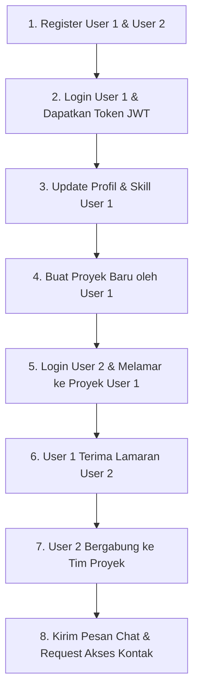

# 🚀 SkillBridge API Documentation — MVP Release

Dokumentasi komprehensif RESTful API backend **SkillBridge** versi MVP (Minimum Viable Product).

---

## 📑 Daftar Isi
1. [Pengenalan & Arsitektur API](#1-pengenalan--arsitektur-api)
2. [Autentikasi & Keamanan](#2-autentikasi--keamanan)
3. [Format Respons & Error Handling](#3-format-respons--error-handling)
4. [Daftar Enum Platform](#4-daftar-enum-platform)
5. [Spesifikasi Endpoint API](#5-spesifikasi-endpoint-api)
   - [5.1 Modul Autentikasi (`/api/auth`)](#51-modul-autentikasi-apiauth)
   - [5.2 Modul Profil & Skill (`/api/profile` & `/api/skills`)](#52-modul-profil--skill-apiprofile--apiskills)
   - [5.3 Modul Proyek & Rekrutmen (`/api/projects`)](#53-modul-proyek--rekrutmen-apiprojects)
   - [5.4 Modul Permintaan Akses Kontak (`/api/contact-requests`)](#54-modul-permintaan-akses-kontak-apicontact-requests)
   - [5.5 Modul Sistem Pencocokan / Matching (`/api/match`)](#55-modul-sistem-pencocokan--matching-apimatch)
   - [5.6 Modul Pesan & Obrolan (`/api/messages`)](#56-modul-pesan--obrolan-apimessages)
6. [Alur Pengujian MVP (Testing Flow Guide)](#6-alur-pengujian-mvp-testing-flow-guide)

---

## 1. 🌐 Pengenalan & Arsitektur API

| Parameter | Spesifikasi |
| :--- | :--- |
| **Base URL (Local)** | `http://localhost:8080` |
| **Default Protocol** | HTTP / HTTPS |
| **Content-Type** | `application/json` |
| **Format Encoding** | UTF-8 |

---

## 2. 🔑 Autentikasi & Keamanan

Autentikasi menggunakan **JSON Web Token (JWT)** Stateless. Kecuali endpoint publik pada `/api/auth/**`, seluruh endpoint memerlukan header HTTP berikut:

```http
Authorization: Bearer <JWT_TOKEN_ANDA>
Content-Type: application/json
```

---

## 3. ⚠️ Format Respons & Error Handling

### Standard Error Response Format
Jika terjadi kesalahan (*Validation*, *Bad Request*, *Forbidden*, *Not Found*, dll.), server akan mengembalikan objek JSON berikut:

```json
{
  "status": 400,
  "error": "Bad Request",
  "message": "NIM sudah digunakan",
  "errors": [
    "nim: NIM sudah terdaftar di sistem"
  ],
  "timestamp": "2026-07-24T21:45:00",
  "path": "/api/profile/me"
}
```

### Ringkasan Kode Status HTTP
* **`200 OK`**: Permintaan berhasil diproses.
* **`201 Created`**: Sumber daya baru berhasil dibuat.
* **`204 No Content`**: Permintaan berhasil, tidak ada data kembalian (contoh: DELETE).
* **`400 Bad Request`**: Format JSON tidak valid atau validasi input gagal.
* **`401 Unauthorized`**: Token JWT tidak valid, kedaluwarsa, atau tidak dikirimkan.
* **`403 Forbidden`**: Tidak memiliki hak akses terhadap resource/aksi tersebut.
* **`404 Not Found`**: Resource yang diminta tidak ditemukan.
* **`409 Conflict`**: Terjadi bentrokan data (contoh: email/NIM ganda, lamaran ganda).

---

## 4. 📚 Daftar Enum Platform

### `Role`
* `MAHASISWA` — Akun pengguna utama (Mahasiswa).
* `ADMIN` — Akun pengelola sistem.

### `ContactPrivacy`
* `PUBLIC` — Kontak (WhatsApp, Instagram, LinkedIn) dapat dilihat oleh seluruh pengguna terautentikasi.
* `PRIVATE` — Kontak hanya dapat dilihat setelah permintaan akses disetujui (*APPROVED*).

### `SkillLevel`
* `BEGINNER` — Tingkat Pemula.
* `INTERMEDIATE` — Tingkat Menengah.
* `ADVANCED` — Tingkat Mahir / Ahli.

### `ProjectCategory`
* `PKM` — Program Kreativitas Mahasiswa.
* `LOMBA` — Kompetisi / Hackathon.
* `STARTUP` — Proyek Startup / Bisnis.
* `PENELITIAN` — Riset & Penelitian Akademik.
* `MAGANG` — Proyek Magang / Internship.
* `OPEN_SOURCE` — Proyek Kontribusi Open Source.
* `LAINNYA` — Kategori lainnya.

### `ProjectStatus`
* `OPEN` — Rekrutmen sedang dibuka.
* `CLOSED` — Rekrutmen ditutup (kapasitas penuh / ditutup ketua).
* `COMPLETED` — Proyek telah selesai dilaksanakan.

### `ApplicationStatus`
* `PENDING` — Menunggu keputusan ketua tim.
* `ACCEPTED` — Diterima (otomatis bergabung menjadi anggota tim).
* `REJECTED` — Ditolak.

### `ContactRequestStatus`
* `PENDING` — Permintaan menunggu persetujuan.
* `APPROVED` — Permintaan disetujui.
* `REJECTED` — Permintaan ditolak.

---

## 5. 📑 Spesifikasi Endpoint API

### 5.1 Modul Autentikasi (`/api/auth`)

#### 1. Registrasi Akun Baru
* **Endpoint:** `POST /api/auth/register`
* **Keamanan:** Public
* **Request Body:**
```json
{
  "email": "budi@student.ac.id",
  "password": "Password123!",
  "role": "MAHASISWA"
}
```
* **Response (200 OK):**
```json
{
  "message": "User berhasil didaftarkan!"
}
```

#### 2. Login Pengguna
* **Endpoint:** `POST /api/auth/login`
* **Keamanan:** Public
* **Request Body:**
```json
{
  "email": "budi@student.ac.id",
  "password": "Password123!"
}
```
* **Response (200 OK):**
```json
{
  "token": "eyJhbGciOiJIUzI1NiJ9.eyJzdWIiOiJidWRpQHN0dWRlbnQuYWMuaWQiLCJpYXQiOjE3Nzk4NDgwMDAsImV4cCI6MTc3OTkzNDQwMH0...",
  "type": "Bearer",
  "id": 1,
  "email": "budi@student.ac.id",
  "role": "MAHASISWA"
}
```

---

### 5.2 Modul Profil & Skill (`/api/profile` & `/api/skills`)

#### 1. Ambil Profil Saya
* **Endpoint:** `GET /api/profile/me`
* **Keamanan:** Authenticated
* **Response (200 OK):**
```json
{
  "id": 1,
  "userId": 1,
  "email": "budi@student.ac.id",
  "namaLengkap": "Budi Santoso",
  "nim": "220101001",
  "prodi": "Teknik Informatika",
  "angkatan": "2022",
  "bio": "Software Engineer & AI Enthusiast",
  "fotoUrl": "https://example.com/budi.jpg",
  "whatsapp": "081234567890",
  "instagram": "@budi.dev",
  "linkedin": "https://linkedin.com/in/budisantoso",
  "contactPrivacy": "PUBLIC",
  "skills": [
    {
      "skillId": 1,
      "skillName": "Java",
      "category": "Backend",
      "level": "ADVANCED"
    }
  ]
}
```

#### 2. Update Biodata & Kontak Profil
* **Endpoint:** `PUT /api/profile/me`
* **Keamanan:** Authenticated
* **Request Body:**
```json
{
  "namaLengkap": "Budi Santoso, S.Kom",
  "nim": "220101001",
  "prodi": "Teknik Informatika",
  "angkatan": "2022",
  "bio": "Fullstack Java & React Developer",
  "fotoUrl": "https://example.com/budi_new.jpg",
  "whatsapp": "081234567890",
  "instagram": "@budi.tech",
  "linkedin": "https://linkedin.com/in/budisantoso"
}
```
* **Response (200 OK):** Sama dengan struktur `ProfileResponse`.

#### 3. Update Privasi Kontak
* **Endpoint:** `PUT /api/profile/me/privacy`
* **Keamanan:** Authenticated
* **Request Body:**
```json
{
  "contactPrivacy": "PRIVATE"
}
```
* **Response (200 OK):** Sama dengan struktur `ProfileResponse`.

#### 4. Lihat Profil Publik Pengguna Lain
* **Endpoint:** `GET /api/profile/{userId}`
* **Keamanan:** Authenticated
* **Response (200 OK - Jika Privacy PRIVATE & Belum Approved):**
```json
{
  "userId": 2,
  "namaLengkap": "Siti Rahma",
  "nim": "220101002",
  "prodi": "Sistem Informasi",
  "angkatan": "2022",
  "bio": "UI/UX Designer",
  "fotoUrl": "https://example.com/siti.jpg",
  "whatsapp": null,
  "instagram": null,
  "linkedin": null,
  "contactPrivacy": "PRIVATE",
  "contactRequestStatus": null,
  "skills": []
}
```

#### 5. Ambil Daftar Skill Saya
* **Endpoint:** `GET /api/profile/me/skills`
* **Keamanan:** Authenticated
* **Response (200 OK):**
```json
[
  {
    "skillId": 1,
    "skillName": "Spring Boot",
    "category": "Backend",
    "level": "INTERMEDIATE"
  }
]
```

#### 6. Tambahkan Skill ke Profil
* **Endpoint:** `POST /api/profile/me/skills`
* **Keamanan:** Authenticated
* **Request Body:**
```json
{
  "skillId": 1,
  "level": "ADVANCED"
}
```
* **Response (200 OK):** `UserSkillResponse`

#### 7. Hapus Skill dari Profil
* **Endpoint:** `DELETE /api/profile/me/skills/{skillId}`
* **Keamanan:** Authenticated
* **Response (204 No Content)**

#### 8. Lihat Semua Master Skill
* **Endpoint:** `GET /api/skills`
* **Keamanan:** Authenticated
* **Response (200 OK):**
```json
[
  {
    "id": 1,
    "name": "Spring Boot",
    "category": "Backend"
  },
  {
    "id": 2,
    "name": "React.js",
    "category": "Frontend"
  }
]
```

#### 9. Cari Master Skill
* **Endpoint:** `GET /api/skills/search?q=spring`
* **Keamanan:** Authenticated
* **Response (200 OK):** Daftar skill yang sesuai.

---

### 5.3 Modul Proyek & Rekrutmen (`/api/projects`)

#### 1. Buat Proyek Baru
* **Endpoint:** `POST /api/projects`
* **Keamanan:** Authenticated (Creator otomatis jadi Ketua Tim)
* **Request Body:**
```json
{
  "title": "Aplikasi SkillBridge Mobile",
  "description": "Membangun aplikasi platform kolaborasi mahasiswa.",
  "category": "LOMBA",
  "maxMembers": 3,
  "requiredSkills": "Flutter, Spring Boot, PostgreSQL"
}
```
* **Response (201 Created):**
```json
{
  "id": 10,
  "title": "Aplikasi SkillBridge Mobile",
  "description": "Membangun aplikasi platform kolaborasi mahasiswa.",
  "category": "LOMBA",
  "status": "OPEN",
  "maxMembers": 3,
  "currentMemberCount": 1,
  "pendingApplicationCount": 0,
  "requiredSkills": "Flutter, Spring Boot, PostgreSQL",
  "createdByUserId": 1,
  "createdByName": "Budi Santoso",
  "hasApplied": false,
  "isOwner": true,
  "createdAt": "2026-07-24T21:45:00"
}
```

#### 2. Browse Seluruh Proyek Open
* **Endpoint:** `GET /api/projects?q=Mobile&page=0&size=20`
* **Keamanan:** Authenticated
* **Response (200 OK):** Object Page Spring Data (`content`, `totalPages`, `totalElements`, dll.).

#### 3. Proyek Saya (Sebagai Ketua)
* **Endpoint:** `GET /api/projects/my`
* **Keamanan:** Authenticated
* **Response (200 OK):** Array dari `ProjectResponse`.

#### 4. Detail Satu Proyek
* **Endpoint:** `GET /api/projects/{id}`
* **Keamanan:** Authenticated

#### 5. Update Proyek
* **Endpoint:** `PUT /api/projects/{id}`
* **Keamanan:** Authenticated (Hanya Ketua Tim)

#### 6. Hapus Proyek (Soft-Delete)
* **Endpoint:** `DELETE /api/projects/{id}`
* **Keamanan:** Authenticated (Hanya Ketua Tim)
* **Response (204 No Content)**

#### 7. Melamar ke Proyek
* **Endpoint:** `POST /api/projects/{id}/apply`
* **Keamanan:** Authenticated
* **Request Body:**
```json
{
  "positionApplied": "Frontend Developer",
  "message": "Saya ahli Flutter dan berminat bergabung."
}
```
* **Response (201 Created):**
```json
{
  "id": 5,
  "projectId": 10,
  "projectTitle": "Aplikasi SkillBridge Mobile",
  "applicantId": 2,
  "applicantName": "Siti Rahma",
  "applicantNim": "220101002",
  "positionApplied": "Frontend Developer",
  "message": "Saya ahli Flutter dan berminat bergabung.",
  "status": "PENDING",
  "createdAt": "2026-07-24T21:46:00"
}
```

#### 8. Lihat Lamaran Masuk (Ketua Tim)
* **Endpoint:** `GET /api/projects/{id}/applications`
* **Keamanan:** Authenticated (Hanya Ketua Tim)

#### 9. Terima Lamaran Pelamar
* **Endpoint:** `PUT /api/projects/{id}/applications/{appId}/accept`
* **Keamanan:** Authenticated (Hanya Ketua Tim)
* **Efek Samping:** Status lamaran berubah `ACCEPTED`, pelamar otomatis ditambahkan ke tim. Jika kapasitas tim penuh, status proyek otomatis berubah menjadi `CLOSED`.

#### 10. Tolak Lamaran Pelamar
* **Endpoint:** `PUT /api/projects/{id}/applications/{appId}/reject`
* **Keamanan:** Authenticated (Hanya Ketua Tim)

#### 11. Lihat Lamaran Saya
* **Endpoint:** `GET /api/projects/applications/my`
* **Keamanan:** Authenticated

#### 12. Lihat Anggota Resmi Tim Proyek
* **Endpoint:** `GET /api/projects/{id}/team`
* **Keamanan:** Authenticated
* **Response (200 OK):**
```json
[
  {
    "id": 1,
    "projectId": 10,
    "userId": 1,
    "userName": "Budi Santoso",
    "userNim": "220101001",
    "teamRole": "Ketua Tim",
    "joinedAt": "2026-07-24T21:45:00"
  },
  {
    "id": 2,
    "projectId": 10,
    "userId": 2,
    "userName": "Siti Rahma",
    "userNim": "220101002",
    "teamRole": "Frontend Developer",
    "joinedAt": "2026-07-24T21:47:00"
  }
]
```

---

### 5.4 Modul Permintaan Akses Kontak (`/api/contact-requests`)

#### 1. Kirim Permintaan Akses Kontak
* **Endpoint:** `POST /api/contact-requests/{targetUserId}`
* **Keamanan:** Authenticated
* **Response (200 OK):**
```json
{
  "id": 8,
  "requesterId": 1,
  "requesterName": "Budi Santoso",
  "requesterNim": "220101001",
  "targetId": 2,
  "targetName": "Siti Rahma",
  "status": "PENDING",
  "createdAt": "2026-07-24T21:48:00"
}
```

#### 2. Lihat Permintaan Masuk (Target)
* **Endpoint:** `GET /api/contact-requests/incoming`
* **Keamanan:** Authenticated

#### 3. Lihat Permintaan Keluar (Requester)
* **Endpoint:** `GET /api/contact-requests/outgoing`
* **Keamanan:** Authenticated

#### 4. Setujui Permintaan Kontak
* **Endpoint:** `PUT /api/contact-requests/{requestId}/approve`
* **Keamanan:** Authenticated (Hanya Target)

#### 5. Tolak Permintaan Kontak
* **Endpoint:** `PUT /api/contact-requests/{requestId}/reject`
* **Keamanan:** Authenticated (Hanya Target)

---

### 5.5 Modul Sistem Pencocokan / Matching (`/api/match`)

#### 1. Proyek Paling Cocok Untuk Saya
* **Endpoint:** `GET /api/match/projects`
* **Keamanan:** Authenticated
* **Response (200 OK):**
```json
[
  {
    "projectId": 10,
    "title": "Aplikasi SkillBridge Mobile",
    "category": "LOMBA",
    "requiredSkills": ["Flutter", "Spring Boot", "PostgreSQL"],
    "matchingSkills": ["Spring Boot", "PostgreSQL"],
    "matchScore": 66.67,
    "currentMembers": 2,
    "maxMembers": 3
  }
]
```

#### 2. Score Matching Proyek Spesifik
* **Endpoint:** `GET /api/match/projects/{id}`
* **Keamanan:** Authenticated

#### 3. Cari Rekan/Kolaborator Proyek
* **Endpoint:** `GET /api/match/collaborators?projectId={id}`
* **Keamanan:** Authenticated (Untuk Ketua Tim)

---

### 5.6 Modul Pesan & Obrolan (`/api/messages`)

#### 1. Kirim Pesan
* **Endpoint:** `POST /api/messages/{receiverId}`
* **Keamanan:** Authenticated
* **Request Body:**
```json
{
  "content": "Halo Siti, senang bisa bekerja sama di tim ini!"
}
```
* **Response (201 Created):**
```json
{
  "id": 100,
  "senderId": 1,
  "senderName": "Budi Santoso",
  "receiverId": 2,
  "receiverName": "Siti Rahma",
  "content": "Halo Siti, senang bisa bekerja sama di tim ini!",
  "isRead": false,
  "createdAt": "2026-07-24T21:50:00"
}
```

#### 2. Daftar Obrolan Active (`Conversations`)
* **Endpoint:** `GET /api/messages/conversations`
* **Keamanan:** Authenticated

#### 3. Riwayat Chat dengan Pengguna
* **Endpoint:** `GET /api/messages/conversations/{partnerId}`
* **Keamanan:** Authenticated (Otomatis menandai pesan partner sebagai telah dibaca).

---

## 6. 🧪 Alur Pengujian MVP (Testing Flow Guide)

Untuk menguji seluruh alur kerja sistem backend MVP secara berurutan menggunakan Postman / HTTP Client:



1. **Registrasi 2 Akun:** Panggil `POST /api/auth/register` untuk **User 1 (Budi)** dan **User 2 (Siti)**.
2. **Login User 1:** Panggil `POST /api/auth/login` dengan kredensial User 1 untuk mengambil Token JWT. Simpan token ini.
3. **Lengkapi Profil User 1:** Set token pada header `Authorization: Bearer <TOKEN>`, lalu panggil `PUT /api/profile/me` dan `POST /api/profile/me/skills`.
4. **Buat Proyek:** Panggil `POST /api/projects` untuk membuat proyek rekrutmen.
5. **Login & Melamar (User 2):** Login sebagai User 2, ambil tokennya, lalu panggil `POST /api/projects/{id}/apply` ke proyek User 1.
6. **Proses Lamaran (User 1):** Gunakan kembali token User 1, panggil `PUT /api/projects/{id}/applications/{appId}/accept`.
7. **Verifikasi Tim & Chat:** Panggil `GET /api/projects/{id}/team` untuk memverifikasi User 2 telah resmi bergabung dalam tim, lalu panggil `POST /api/messages/{user2_id}` untuk saling berkirim pesan.
